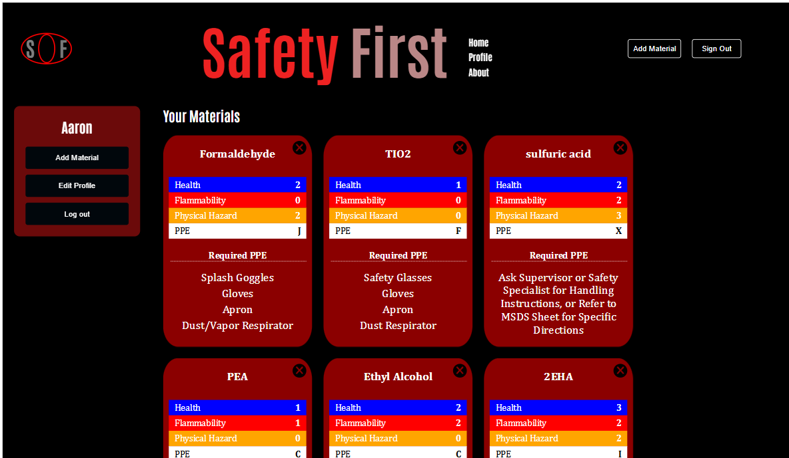

** NOTE TO CODE REVIEWER **

The search bar is not connected to an API, it only is designed for later when the website will have hundreds of chemicals to filter. To test out the API, you need to sign in, then add a material. The CAS number input is connected to an API. When adding a material, fill out the cas number input with a real cas number. For example, for Formaldehyde you'd need to put 50-00-0 in the cas number input

Safety First App

What is the Safety First App?
The Safety First App is a safety-focused web application designed to help users properly identify and manage hazardous chemicals. It stores critical safety information including HMIS (Hazardous Materials Identification System) ratings and required Personal Protective Equipment (PPE) for each chemical material.

Key Features
Chemical Safety Information: Store and view HMIS ratings for health, flammability, and physical hazards
PPE Requirements: Quick access to required personal protective equipment for each chemical
Search Function: Quickly locate specific chemicals and their safety data
Material Management: Add new chemicals and update existing safety information

How to Use
Use the search bar to quickly find specific chemicals
View detailed HMIS ratings and safety information for each chemical
Check required PPE before handling any material
Add new chemicals using the add button, including all safety ratings and PPE requirements

Deployed website: https://aaronicle.github.io/SafetyFirst/#/

Repository: https://github.com/Aaronicle/SafetyFirst
